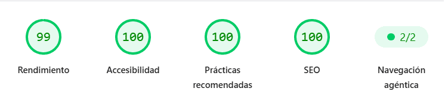
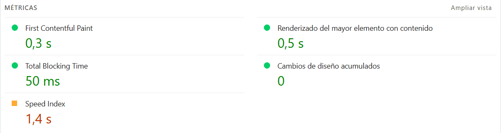

🌐 **Idioma:** **Español** | [English Version](README.md)

# 🚀 Portafolio de Desarrollador Web — SPA

[](https://federico-aguirre-portafolio-next-js.vercel.app)

[](https://federico-aguirre-portfolio-next-js.vercel.app/)
[](https://nextjs.org/)
[](https://www.typescriptlang.org/)
[](https://pagespeed.web.dev/analysis/https-federico-aguirre-portfolio-next-js-vercel-app-en/rw1kyveopj?form_factor=desktop)
[](LICENSE)

> Un portafolio web interactivo de alto rendimiento construido como una **Single Page Application (SPA)** con Next.js 14, enfocado en la accesibilidad universal (**a11y**), animación vectorial y 3D, soporte multiidioma (**i18n**) y validación de datos segura.

---

## ⚡ PageSpeed Benchmarks & Auditoría Web Vitals

Este proyecto fue auditado minuciosamente y optimizado a nivel de hilo principal, bundle de JavaScript y marcado semántico para cumplir con los estándares de rendimiento y accesibilidad más exigentes de la web actual:

| Métrica                                     | Resultado |      Estado      |
| :------------------------------------------ | :-------: | :--------------: |
| **Rendimiento (Desktop)**                   |  **99%**  | 🟢 Sobresaliente |
| **Accesibilidad (a11y)**                    | **100%**  |   🟢 Perfecto    |
| **Buenas Prácticas**                        | **100%**  |   🟢 Perfecto    |
| **SEO**                                     | **100%**  |   🟢 Perfecto    |
| **Navegación Agéntica (Compatibilidad IA)** | **2 / 2** | 🟢 WCAG Completo |

> 🔗 **[Ver Auditoría Oficial e Informe en Vivo en Google PageSpeed Insights](https://pagespeed.web.dev/analysis/https-federico-aguirre-portfolio-next-js-vercel-app-en/rw1kyveopj?form_factor=desktop)**

### 📷 Captura de Auditoría (PageSpeed)

[](https://pagespeed.web.dev/analysis/https-federico-aguirre-portfolio-next-js-vercel-app-en/rw1kyveopj?form_factor=desktop)

[](https://pagespeed.web.dev/analysis/https-federico-aguirre-portfolio-next-js-vercel-app-en/rw1kyveopj?form_factor=desktop)

---

## 🔒 Arquitectura de Rendimiento & Accesibilidad (A11y)

- 🏎️ **Tree-Shaking de Animaciones con `LazyMotion`:**
  - Reducción de **~70% del bundle inicial de animación** mediante `LazyMotion` y la variante liviana `domAnimation` de Framer Motion al nivel del `RootLayout`.
  - Migración completa de componentes pesados `<motion.*>` a componentes optimizados `<m.*>` para evitar la descarga del motor completo en la primera carga.
- 🚀 **Optimización del LCP (Largest Contentful Paint):**
  - Eliminación de bloques invisibles (`opacity: 0` inicial) y demoras de animación _Above the Fold_ en el Hero, garantizando la renderización inmediata del primer render desde SSR.
- ♿ **Navegación Agéntica & Estándares WCAG:**
  - Estructura estricta de componentes de pestañas (`role="tablist"`, `role="tab"`, `role="tabpanel"`) y aislamiento de contenedores decorativos con `role="presentation"` y `aria-hidden="true"`.
  - Jerarquía descendente de encabezados semánticos (`h1` ➔ `h2` ➔ `h3`) sin saltos de nivel visuales.
  - Detección activa de preferencia de movimiento reducido (`useReducedMotion`) para prevenir mareos en usuarios con sensibilidad vestibular.
- ⚡ **Aceleración por Hardware (GPU Compositing):**
  - Pistas de composición directa mediante CSS `will-change: transform, opacity` para asegurar animaciones suaves a 60 FPS sin provocar repintados de diseño (_Layout Shifts / CLS_).

---

## 🛠️ Tech Stack

### Core & Framework


### Estilos & Animaciones


### Estado & Formularios


### Internacionalización & UI Utils


---

## ✨ Características Principales

- ⚡ **Experiencia SPA Fluida:** Navegación continua entre las secciones _Home, Projects, About Me_ y _Contact_ sin recargas molestas de página.
- 🌍 **Internacionalización (i18n):**
  - Soporte multilenguaje (Español / Inglés) implementado con `next-intl`.
  - Preservación de posición de scroll en transiciones mediante almacenamiento de sesión y sincronización dinámica.
- 🎡 **Carrusel & Filtro de Proyectos (`Projects`):**
  - Segmentación dinámica por categorías (Principales y Laboratorio).
  - Slider/Ruleta responsiva impulsada por **Embla Carousel**.
  - Rutas dinámicas `/projects/[slug]` para ver detalles ampliados de cada proyecto, video demostrativo y enlaces en vivo.
- 🎨 **Más de 70 Componentes SVG Animados Nativos en TSX (`About Me / Skills`):**
  - Iconografía interactiva desarrollada en código puro (`m.svg` y `m.path`) utilizando **Framer Motion**.
  - Micro-interacciones vectoriales ultra livianas y completamente adaptables al tema dinámico sin librerías pesadas externas.
- 🌌 **Animaciones & Partículas 3D:**
  - Fondo reactivo de partículas 3D utilizando `@tsparticles` (con arquitectura Singleton para evitar fugas de memoria).
- 🌓 **Tema Claro / Oscuro Dinámico:**
  - Estado global gestionado con **Zustand** y sombras dinámicas personalizadas (_Glowing Shadows_).
- 🛡️ **Formulario de Contacto Seguro:**
  - Validación estricta en cliente y servidor mediante **React Hook Form** y esquemas tipados con **Zod**.

---

🌐 Despliegue
Este proyecto está hosteado y desplegado de forma continua en Vercel, aprovechando las optimizaciones nativas para Next.js, como el renderizado híbrido, la compresión de imágenes al vuelo y una Edge Network global para tiempos de carga mínimos.

---

## 💻 Instalación y Configuración Local

Sigue estos pasos para ejecutar el proyecto en tu entorno local:

1. **Clonar el repositorio:**

   ```bash
   git clone [https://github.com/Federico-Aguirre/Federico_Aguirre_Portfolio_NextJs.git](https://github.com/Federico-Aguirre/Federico_Aguirre_Portfolio_NextJs.git)
   cd Federico_Aguirre_Portfolio_NextJs

   ```

2. Instalar dependencias:

   npm install

   # o bien: yarn install / pnpm install / bun install

3. Iniciar el servidor de desarrollo:

   npm run dev

4. Abrir en el navegador:
   Visita http://localhost:3000 para ver la aplicación en funcionamiento.
