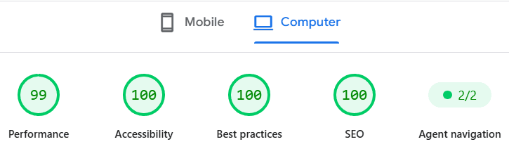
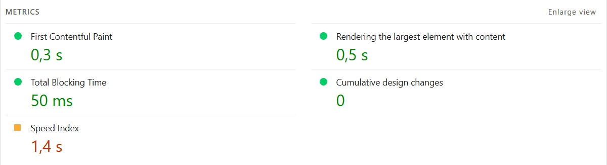

🌐 **Language:** **English** | [Versión en Español](README.es.md)

# 🚀 Web Developer Portfolio — SPA

[](https://federico-aguirre-portfolio-next-js.vercel.app)

[](https://federico-aguirre-portfolio-next-js.vercel.app/)
[](https://nextjs.org/)
[](https://www.typescriptlang.org/)
[](https://pagespeed.web.dev/analysis/https-federico-aguirre-portfolio-next-js-vercel-app-en/rw1kyveopj?form_factor=desktop)
[](LICENSE)

> An interactive, high-performance web portfolio built as a **Single Page Application (SPA)** using Next.js 14, focused on universal accessibility (**a11y**), 3D & vector animations, multi-language support (**i18n**), and secure data validation.

---

## ⚡ PageSpeed Benchmarks & Web Vitals Audit

This project was thoroughly audited and optimized at the main thread level, JavaScript bundle footprint, and semantic markup to meet the highest industry standards for modern web performance and accessibility:

| Metric                                    |   Score   |      Status       |
| :---------------------------------------- | :-------: | :---------------: |
| **Performance (Desktop)**                 |  **99%**  |  🟢 Outstanding   |
| **Accessibility (a11y)**                  | **100%**  |    🟢 Perfect     |
| **Best Practices**                        | **100%**  |    🟢 Perfect     |
| **SEO**                                   | **100%**  |    🟢 Perfect     |
| **Agentic Navigation (AI Compatibility)** | **2 / 2** | 🟢 WCAG Compliant |

> 🔗 **[View Official Live Audit & Report on Google PageSpeed Insights](https://pagespeed.web.dev/analysis/https-federico-aguirre-portfolio-next-js-vercel-app-en/rw1kyveopj?form_factor=desktop)**

### 📷 Audit Screenshot (PageSpeed)

[](https://pagespeed.web.dev/analysis/https-federico-aguirre-portfolio-next-js-vercel-app-en/rw1kyveopj?form_factor=desktop)

[](https://pagespeed.web.dev/analysis/https-federico-aguirre-portfolio-next-js-vercel-app-en/rw1kyveopj?form_factor=desktop)

---

## 🔒 Performance & Accessibility (a11y) Architecture

- 🏎️ **Animation Tree-Shaking with `LazyMotion`:**
  - Reduced **~70% of the initial animation bundle size** by implementing `LazyMotion` with the lightweight `domAnimation` feature set at the `RootLayout` level.
  - Migrated all heavy `<motion.*>` JSX tags to optimized `<m.*>` components to prevent loading the full Framer Motion engine during initial load.
- 🚀 **LCP (Largest Contentful Paint) Optimization:**
  - Eliminated invisible render-blocking states (`opacity: 0` initial state) and layout delay animations _Above the Fold_ in the Hero section, ensuring instant SSR paint.
- ♿ **Agentic Navigation & WCAG Standards:**
  - Strict tab component structure (`role="tablist"`, `role="tab"`, `role="tabpanel"`) and isolation of purely decorative elements using `role="presentation"` and `aria-hidden="true"`.
  - Proper descending semantic heading hierarchy (`h1` ➔ `h2` ➔ `h3`) without visual level skipping.
  - Active motion preference detection (`useReducedMotion`) to prevent motion sickness for users with vestibular sensitivities.
- ⚡ **Hardware Acceleration (GPU Compositing):**
  - Direct CSS composition hints (`will-change: transform, opacity`) ensuring smooth 60 FPS animations without triggering unnecessary Layout Shifts (CLS) or main-thread repaints.

---

## 🛠️ Tech Stack

### Core & Framework


### Styling & Animations


### State & Forms


### Internationalization & UI Utils


---

## ✨ Key Features

- ⚡ **Seamless SPA Experience:** Continuous navigation across _Home, Projects, About Me_, and _Contact_ without page reloads.
- 🌍 **Internationalization (i18n):**
  - Multi-language support (English / Spanish) powered by `next-intl`.
  - Scroll position retention across locale switches managed through session storage and dynamic state sync.
- 🎡 **Project Carousel & Category Filter:**
  - Categorized showcase (Featured Projects & Lab/Experiments).
  - Responsive slider driven by **Embla Carousel**.
  - Dynamic `/projects/[slug]` routes for detailed project breakdowns, video demos, and live URLs.
- 🎨 **70+ Native TSX Animated Vector Icons (`About Me / Skills`):**
  - Custom interactive iconography built in pure TSX (`m.svg` & `m.path`) using **Framer Motion**.
  - Ultra-lightweight vector micro-interactions tailored to active theme palettes without third-party dependencies.
- 🌌 **3D Particles & Background Animations:**
  - Interactive 3D canvas using `@tsparticles` (implemented via Singleton architecture to prevent memory leaks).
- 🌓 **Dynamic Light / Dark Theme:**
  - Global state powered by **Zustand** with custom glowing drop shadows.
- 🛡️ **Secure Contact Form:**
  - Client and server-side validation enforced with **React Hook Form** and strict **Zod** schema inference.

---

## 💻 Local Installation & Setup

Follow these steps to run the project locally:

1. **Clone the repository:**
   ```bash
   git clone [https://github.com/Federico-Aguirre/Federico_Aguirre_Portfolio_NextJs.git](https://github.com/Federico-Aguirre/Federico_Aguirre_Portfolio_NextJs.git)
   cd Federico_Aguirre_Portfolio_NextJs
   ```
